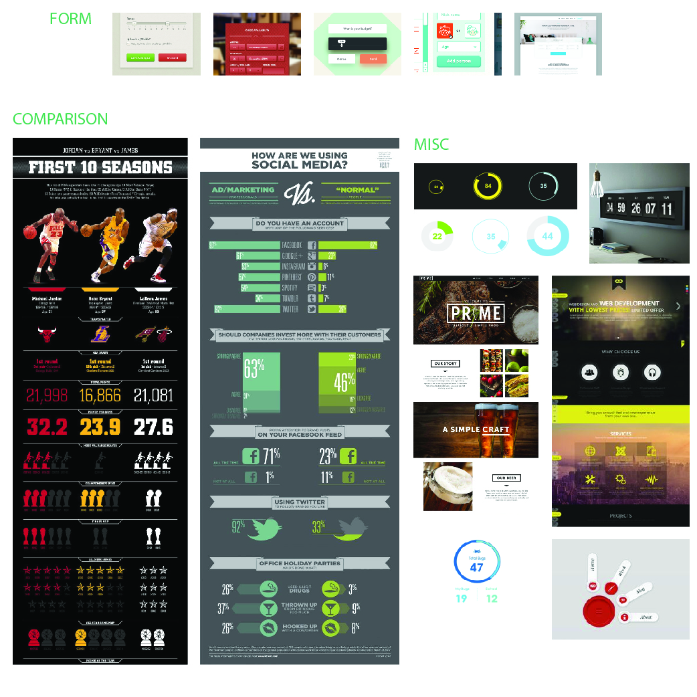
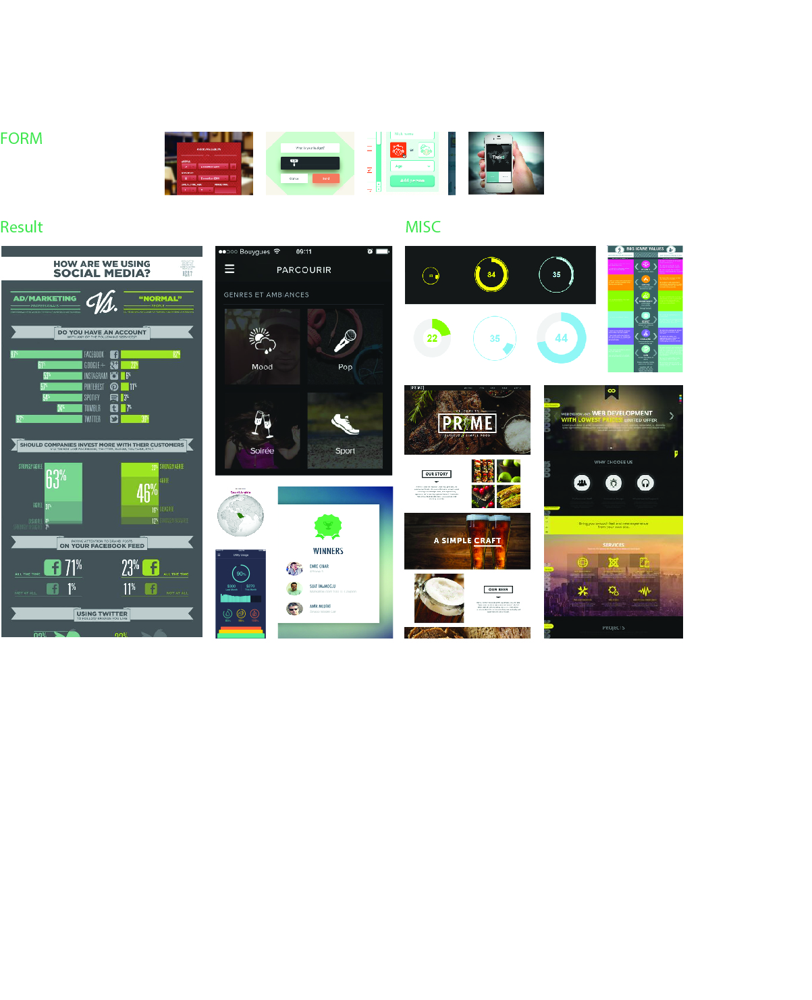
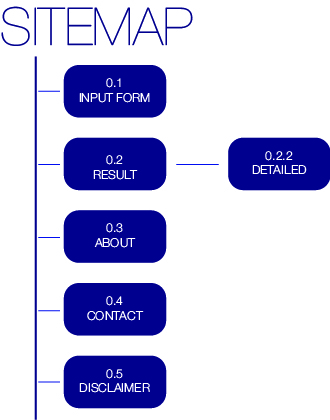
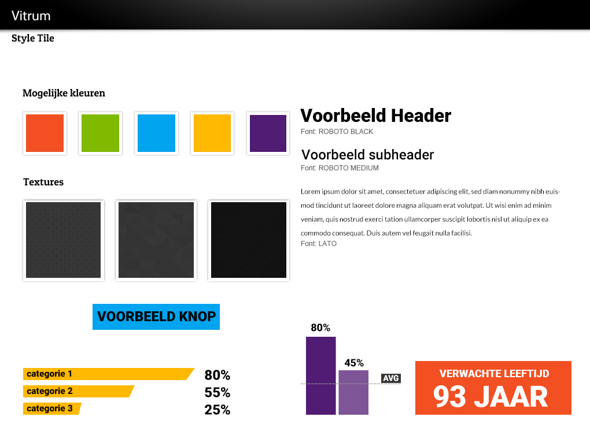
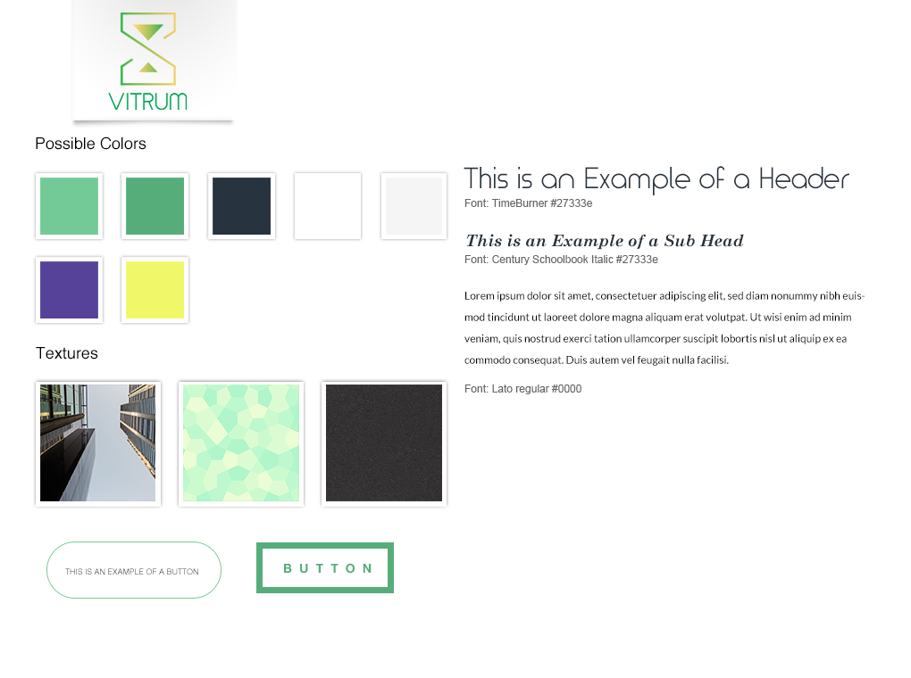
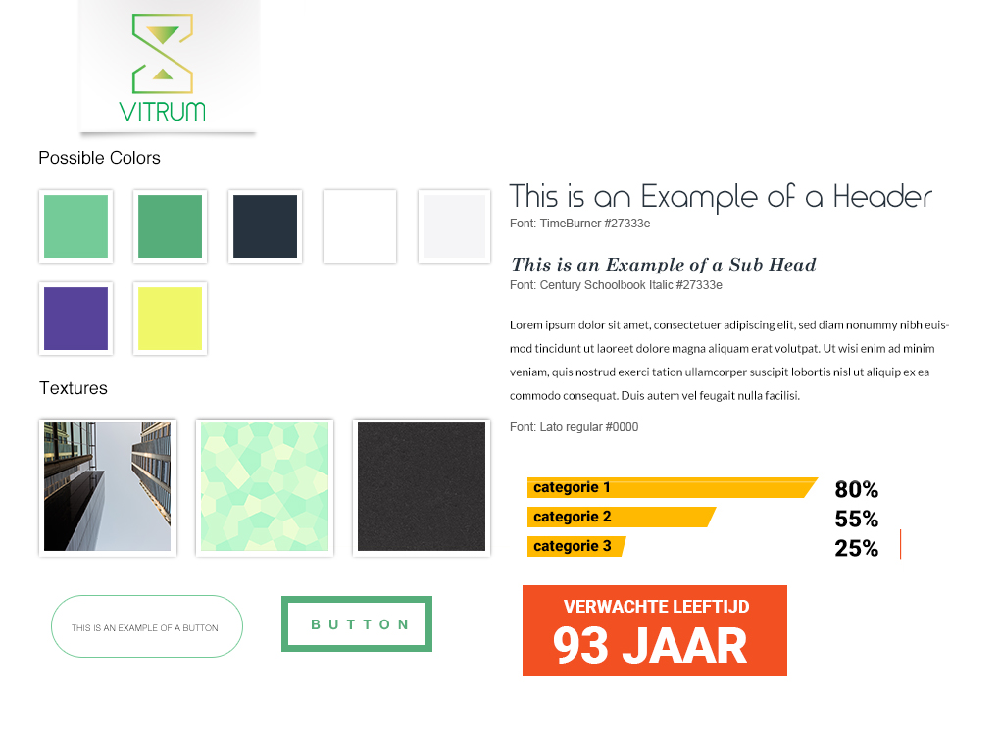
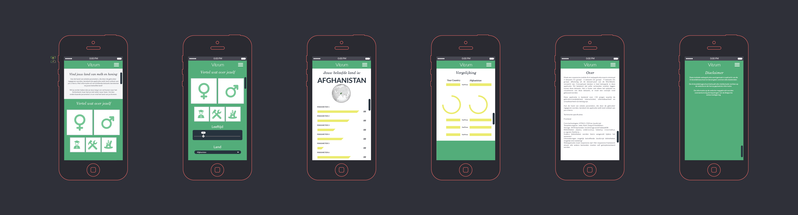
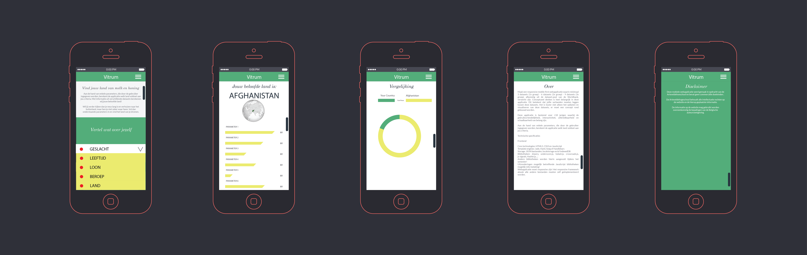

# Vitrum
## Briefing & Analyse

Maak een responsive mobile-first webapplicatie waarin minimaal 3 datasets (1x groep) - 6 datasets (2x groep) - 9 datasets (3x groep), afkomstig uit de dataset-pool van de Worldbank, verwerkt zijn. Conceptueel denken is heel belangrijk in deze applicatie. Dit betekent dat jullie verbanden moeten leggen tussen deze datasets. Het is louter niet alleen het oplijsten en visualiseren van deze datasets, er moet een concept rond gebouwd worden.

Deze applicatie is bestemd voor +18 jarigen waarbij de gebruiksvriendelijkheid, interactiviteit, uitbreidbaarheid en schaalbaarheid van belang zijn.

Aan de hand van enkele parameters, die door de gebruiker ingegeven worden, berekent de applicatie welk land voldoet aan jou criteria. 
Het aantal parameters is nog niet bepaald. We zoeken nog naar een evenwicht tussen enerzijds de interesse van de gebruiker niet te verliezen, en anderzijds een niet te oppervlakkige selectie maken.
## Functionele specificaties
* One Page Webapplication
	* Bookmark routes
	* of een webapplicatie bestaande uit verschillende pagina's
* Preloaders/Loaders
	* Om de app in te laden
	* Tijdens het inladen van JSON(P)
	* Lokale data bestanden
* De meeste inhoud wordt beheerd in data bastanden en dynamisch ingeladen
* Adaptive images, video's en sounds
* Google Maps integratie of gelijkaardig
	* Custom look-and-feel
* GEO-location
	* Toon de locatie van de gebruiker op een Map
	* Hou rekening met deze locatie in andere onderdelen van deze app
* Social Media Bookmarking (Open Graph)
* Animaties via SVG en/of Canvas
* Lokaal caching van data en bronbestanden (cache manifest)
* Gebruiker ervaart een interactief webapplicatie
* Gebruiker kan favoriete data lokaal bewaren
* Gebruiker kan de webapplicatie bookmarken in browser, bureaublad en als native app in het overzicht
* Automation verplicht!
	* Componenten worden via Bower toegevoegd in de components folder van de app folder
	* SASS bestanden worden automatisch omgezet in corresponderende CSS-bestanden
	* CSS-bestanden worden met elkaar verbonden in één bestand en geminified
	* De JS code wordt automatisch nagekeken op syntax fouten JS-bestanden worden met elkaar verbonden in één bestand en geminified
	* De dist-folder wordt automatisch aangevuld met bestanden en folders via Grunt of Gulp
	* Screenshots van de verschillende breekpunten worden automatisch uitgevoerd via Phantom, Casper of andere bibliotheken
##Technische specificaties

##Persona's (+ scenario): Gebruiker (User) (3x)

##Ideëenborden + keuze uit ideëenborden resulterend in een Moodboard
####2x groep van 2 studenten + finaal 1 resulterende Moodboard

###### Finaal Ideebord

##Sitemap

##Wireframes
####minimaal 6x groep van 2 studenten

##Style Tiles
####2x groep van 2 studenten + finaal 1 resulterende style tile

###### Finaal Styletile

##Visual designs
####2x groep van 2 studenten + finaal 1 resulterende visual design

##Screenshots eindresultaat
####minimaal 6x groep van 2 studenten

##Screenshots snippets HTML (1x), CSS (1x) en JavaScript (3x)
####6x groep van 2 studenten

##Tijdsbesteding per student
